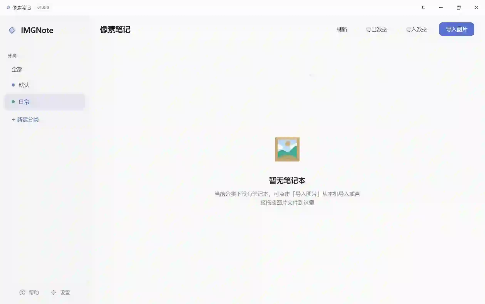
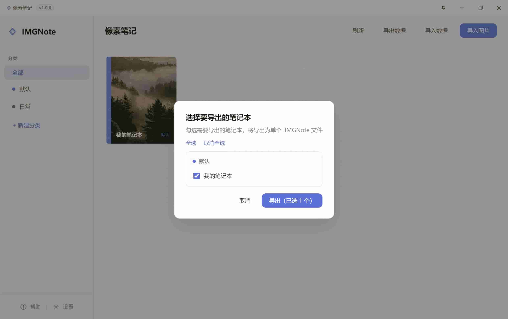
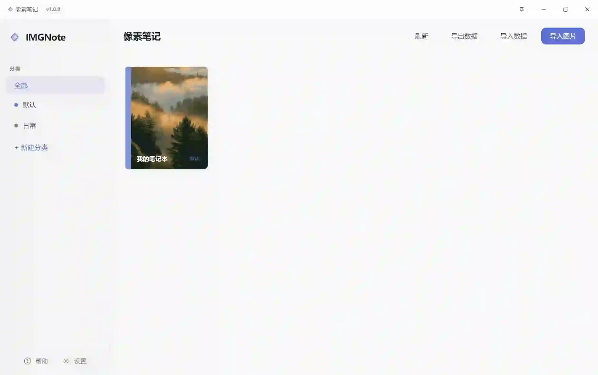
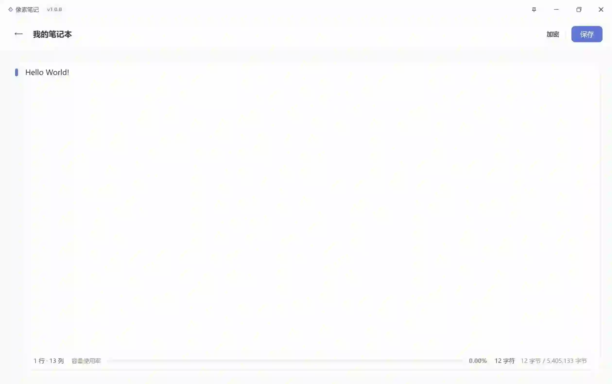

# IMGNote / 像素笔记

<div align="center">

**将文字刻进像素的笔记本**

*以图像像素为载体将信息写入图像中，每一张图片即一本独立笔记本，可用图像来隐蔽分享或存储重要信息*

[](https://www.electronjs.org/)
[](https://vuejs.org/)
[](https://spring.io/projects/spring-boot)
[](https://openjdk.org/)

[功能特点](#-功能特点) • [使用指南](#-使用指南) • [快速开始](#-快速开始) • [项目结构](#-项目结构) • [开发指南](#-开发指南)

</div>

---

## ✨ 功能特点

- **图片即笔记本**：导入任意图片，通过像素隐写将文字信息刻入图像，肉眼无法察觉
- **跨平台桌面应用**：Windows / macOS / Linux 原生体验，系统托盘、单实例运行
- **分类管理**：多级分类、轻松移动、自定义颜色，轻松组织大量笔记
- **可选加密**：支持密码加密，保护私密内容
- **一键备份**：导出为 `.IMGNote` 单文件归档，支持选择性导出与 MD5 去重导入
- **主题切换**：浅色 / 深色模式，设置持久化

### 写入原理

通过修改图像像素的**最低有效位（LSB）**，将文字编码写入 RGBA 通道。图片外观与普通图片无异，只有在本应用中打开才能还原为可编辑文字。

> ⚠️ **注意事项**：请勿对笔记本图片裁剪、缩放、压缩或重新保存，否则写入的数据可能无法恢复。建议定期导出备份。

---

## 📖 使用指南

通过以下截图，直观了解 IMGNote 的完整操作流程。

### 1. 主界面与导入

首次打开应用，左侧为分类导航，右侧为主内容区。若当前分类下暂无笔记本，会显示空状态提示：



**导入图片的两种方式**：点击顶部的「导入图片」按钮，或将图片文件**直接拖拽**到主内容区域。

点击「导入图片」后，在弹出的对话框中可选择目标分类、填写笔记本名称（留空则使用图片文件名）：



导入成功后，笔记会以卡片形式展示，每张卡片以原图作为封面：



### 2. 编辑笔记

点击任意笔记卡片进入编辑器。在文本区域输入内容后，点击「保存」即可将文字隐写入图片像素。



底部状态栏会实时显示：当前行/列、字符数、**容量使用率**（笔记内容占图片可容纳字节的比例）。请注意勿超出容量限制。

---

## 📦 快速开始

### 环境要求

| 组件 | 版本 |
|------|------|
| Node.js | 18+ |
| Java | 17（开发时需本地安装；打包版已内嵌 JRE） |
| Maven | 3.6+ |

### 1. 克隆项目

```bash
git clone https://github.com/L-Hong-Yu/IMGNote.git
cd IMGNote
```

### 2. 构建后端（隐写服务）

```bash
cd IMGNoteServer
mvn clean package
```

产物：`target/IMGNoteServer-1.0.0.jar`

### 3. 配置客户端

将构建好的 JAR 放入客户端资源目录：

```
IMGNoteClient/imgnote-client/assets/env/IMGNoteServer-1.0.0.jar
```

（开发时也可将 JAR 复制到 `assets/env/` 目录，运行时将自动启动后端服务）

### 4. 安装并运行客户端

```bash
cd IMGNoteClient/imgnote-client
npm install
npm run dev
```

### 5. 打包发布

```bash
# Windows 安装包
npm run build:win

# macOS
npm run build:mac

# Linux
npm run build:linux
```


---

## 🏗 项目结构

```
IMGNote/
├── IMGNoteClient/                 # 桌面客户端 (Electron + Vue)
│   └── imgnote-client/
│       ├── src/
│       │   ├── main/              # 主进程：窗口、托盘、IPC、后端进程管理
│       │   │   ├── index.js       # 入口、协议注册、自动更新
│       │   │   ├── notebookService.js  # 分类/笔记 CRUD、导入导出
│       │   │   └── store.js       # 数据路径 (electron-store)
│       │   ├── preload/           # 预加载脚本 (contextBridge)
│       │   └── renderer/          # 渲染进程 (Vue 3)
│       │       └── src/
│       │           ├── api/       # 与后端 API 通信
│       │           ├── components/
│       │           ├── stores/    # Pinia 状态
│       │           └── views/     # 首页、编辑器、设置、帮助
│       ├── assets/env/            # 内嵌 JRE + IMGNoteServer JAR
│       └── resources/             # 应用图标
│
└── IMGNoteServer/                 # 隐写服务 (Java Spring Boot)
    └── src/main/java/com/imgnote/
        ├── controller/img/        # 读/写接口
        ├── service/Impl/           # 业务逻辑
        ├── ImgProcessor/          # ImgGen(写入)、ImgParser(读取)
        ├── bean/                  # Header、Img、NoteBook、Pixel
        └── converter/             # 头部构建与解析
```

---

## 🔧 技术栈

| 层级 | 技术 |
|------|------|
| **客户端** | Electron 34、Vue 3、Vite 6、Pinia、Element Plus |
| **构建** | electron-vite、electron-builder |
| **后端** | Spring Boot 3.3、Java 17 |
| **隐写** | 自研 LSB 编码，支持 UTF-8、可选加密 |

---

## 🖥 架构说明

```
┌───────────────────────────────────────────────────────────┐
│                    Electron 主进程                        │
│  ┌─────────────┐  ┌──────────────┐  ┌─────────────────┐   │
│  │ 窗口 / 托盘  │  │ 启动 JVM     │  │ 导入导出 / 协议  │   │
│  └─────────────┘  │ IMGNoteServer│  └─────────────────┘   │
│                   └───────┬──────┘                        │
└───────────────────────────┼───────────────────────────────┘
                            │ localhost:9633
┌───────────────────────────┼───────────────────────────────┐
│                    Vue 渲染进程                            │
│  ┌────────────────────────▼────────────────────────────┐  │
│  │  axios  →  /api/notebook/read | write               │  │
│  └─────────────────────────────────────────────────────┘  │
│  Home | Editor | Settings | Help                          │
└───────────────────────────────────────────────────────────┘
```

- **数据存储**：`userData/dataBase/` 下按 `分类ID/笔记ID/` 组织，每笔记含 `meta.json` 与图片文件
- **安全访问**：`imgnote-file://` 协议限制仅在数据目录内访问

---

## 📖 开发指南

### 客户端开发

```bash
cd IMGNoteClient/imgnote-client
npm run dev
```

- 前端：Vite 开发服务器 (9634) + HMR
- 后端：主进程自动启动 `IMGNoteServer-1.0.0.jar` (9633)

### 后端开发

修改 `IMGNoteServer` 后重新打包，替换 `assets/env/` 中的 JAR，重启客户端即可。

### 推荐 IDE

- **前端**：VSCode + ESLint + Prettier + Volar
- **后端**：IntelliJ IDEA / Eclipse

---

## ❓ 常见问题

**Q: 打开/保存时有点慢？**  
信息需从像素中解析或写回，图片越大、内容越多，耗时越长，属正常现象。

**Q: 可以用手机拍的照片当笔记本吗？**  
可以。高分辨率照片会带来较大文件与较慢解析，若只记少量文字，可先缩小后再导入。

**Q: 图片分享给别人后，对方能看到笔记吗？**  
对方看到的是普通图片；只有分享原图（未被压缩、裁剪、转换）并在本应用中打开才能还原文字。

**Q: 误删了分类或笔记本怎么办？**  
应用内删除不可恢复。若有导出的 `.IMGNote` 备份，可通过「导入数据」找回。

---

## 📄 许可证

[MIT](LICENSE) License

---

<p align="center">
  ⭐ 如果这个项目对你有帮助，欢迎 Star
</p>
